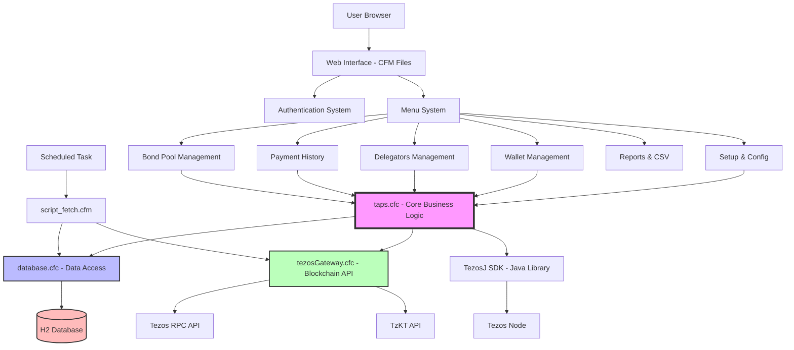
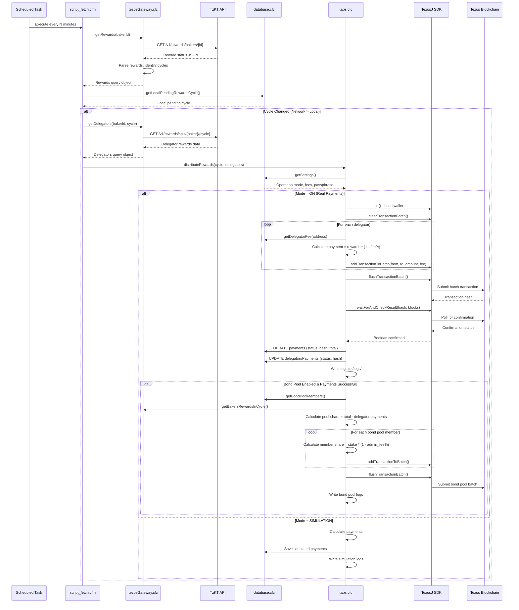
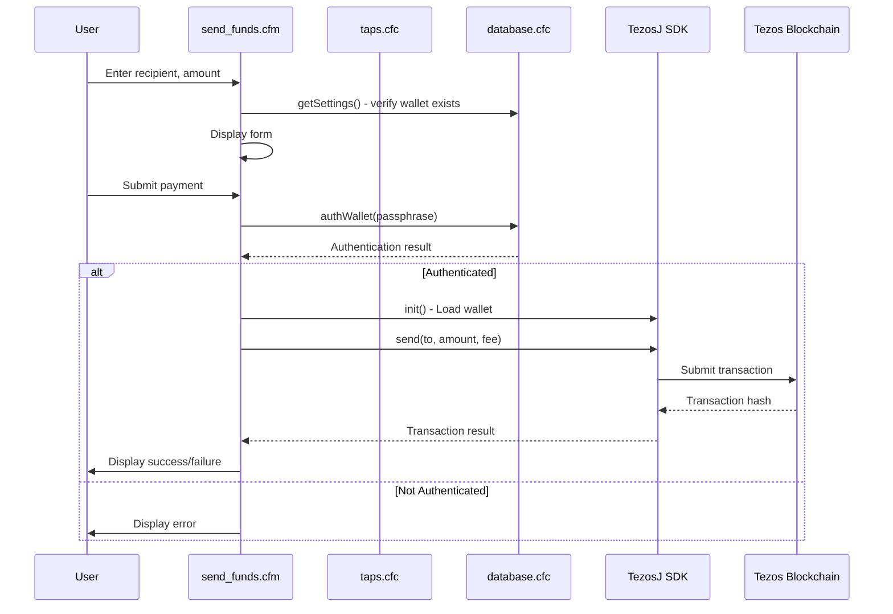

# TAPS Architecture Documentation

## System Overview

TAPS (Tezos Automatic Payment System) is a web-based application designed to automate reward distribution for Tezos bakers to their delegators. The system monitors the Tezos blockchain, calculates reward shares, and executes batch transactions to distribute payments.

## Architecture Pattern

The application follows a **Component-Based Architecture** with a traditional server-side rendering model:

- **Presentation Layer**: CFM files (ColdFusion Markup) - HTML + embedded CFML
- **Business Logic Layer**: CFC files (ColdFusion Components) - Object-oriented components
- **Data Access Layer**: CFC database components
- **External Integration Layer**: Tezos blockchain via RPC and REST APIs

### High-Level Architecture Diagram



## Component Structure

### 1. Application Entry Point

**File**: `application.cfc`

- **Purpose**: Application-wide configuration and initialization
- **Key Responsibilities**:
  - Session management configuration
  - Database connection setup (H2 embedded database)
  - Application-scoped constants and variables
  - Application startup initialization
  - Database table creation on first run

**Important Application Variables**:
```javascript
application.version = "1.2.3"
application.militez = 1000000  // Tezos unit conversion
application.provider = "https://mainnet-tezos.giganode.io"  // Tezos RPC endpoint
application.gasLimit = 15400
application.storageLimit = 300
application.tz_default_operation_fee = "0.001800"
```

### 2. Core Components (CFC Files)

#### **taps.cfc** - Core Business Logic
Location: `/components/taps.cfc`

**Primary Responsibilities**:
- **Rewards Distribution** (`distributeRewards()`) - Main payment engine
- **Authentication** (`authenticate()`) - User login verification
- **Scheduled Task Management** (`createScheduledTask()`, `pauseScheduledTask()`, `resumeScheduledTask()`)
- **System Reset** (`resetTaps()`) - Factory reset functionality
- **Health Checks** (`healthCheck()`) - System integrity verification
- **Custom Batch Payments** (`sendCustomBatch()`) - CSV-based batch transactions

**Key Methods**:
- `distributeRewards()`: Distributes rewards to delegators (600+ lines)
- `authenticate()`: SHA-512 hashed password authentication
- `createScheduledTask()`: Creates periodic Tezos network polling
- `sendCustomBatch()`: Processes custom CSV batch payments

#### **database.cfc** - Data Access Layer
Location: `/components/database.cfc`

**Primary Responsibilities**:
- CRUD operations for all database tables
- Settings management
- Delegator fee management
- Payment history tracking
- Bond pool member management
- Wallet authentication

**Key Methods**:
- `getSettings()`: Retrieve application configuration
- `saveSettings()`: Save application configuration
- `getDelegatorsFees()`: Get custom fee structures
- `saveDelegatorFee()`: Update individual delegator fees
- `getDelegatorsPayments()`: Retrieve payment history
- `getBondPoolMembers()`: Get bond pool member list
- `authWallet()`: Authenticate wallet passphrase

#### **tezosGateway.cfc** - Blockchain Integration
Location: `/components/tezosGateway.cfc`

**Primary Responsibilities**:
- Communication with Tezos blockchain RPC API
- Communication with TzKT API (block explorer API)
- Reward information retrieval
- Delegator information retrieval
- Cycle and block calculations

**Key Methods**:
- `getHead()`: Get current blockchain HEAD metadata
- `getCurrentCycleNumber()`: Get current Tezos cycle
- `getRewards()`: Fetch baker rewards from TzKT API
- `getDelegators()`: Get delegator list with shares and rewards
- `getBakersRewardsInCycle()`: Calculate total rewards for a cycle
- `doHttpRequest()`: Fallback HTTP request handler (curl/wget/cfhttp)

#### **environment.cfc** - Database Schema
Location: `/components/environment.cfc`

**Primary Responsibilities**:
- Database table creation
- Schema initialization

**Tables Created**:
- `settings`: Application configuration
- `payments`: Cycle payment tracking
- `delegatorsPayments`: Individual delegator payment records
- `delegatorsFee`: Custom fee configurations
- `bondPool`: Bond pool member stakes
- `bondPoolSettings`: Bond pool configuration

#### **barcode.cfc** - QR Code Generation
Location: `/components/barcode.cfc`

**Primary Responsibilities**:
- Generate QR codes for Tezos addresses
- Uses ZXing library (Java)

### 3. View Layer (CFM Files)

#### Entry & Authentication
- **index.cfm**: Login page
- **logout.cfm**: Logout handler
- **menu.cfm**: Main navigation menu

#### Configuration & Setup
- **setup.cfm**: Initial application configuration
- **settings.cfm**: Application settings management
- **security.cfm**: Password change

#### Core Functionality
- **wallet.cfm**: Native wallet management (create, view balance, send)
- **delegation.cfm**: Manage delegation settings
- **delegators.cfm**: View and manage delegator fees
- **payments.cfm**: Payment history and reports
- **rewards.cfm**: Reward calculation display
- **status.cfm**: System status and monitoring

#### Payment Operations
- **send_funds.cfm**: Manual fund sending
- **receive_funds.cfm**: Display receive address with QR code
- **csvBatch.cfm**: Batch payment via CSV upload
- **csvBatchSend.cfm**: Execute CSV batch payments

#### Bond Pool
- **bondpool.cfm**: Bond pool member management
- **bp_proxy.cfm**: Bond pool operation proxy

#### Background Operations
- **script_fetch.cfm**: Scheduled task for blockchain polling
- **getBalance.cfm**: AJAX endpoint for balance updates

#### Reporting
- **report_delegate_payments.cfm**: PDF payment reports
- **fees.cfm**: Fee management interface

#### Advanced
- **advanced.cfm**: Advanced settings
- **reset.cfm**: System reset functionality

## Data Flow

### Primary Data Flow: Automated Reward Distribution



### Secondary Data Flow: User-Initiated Payment



## Session & State Management

### Session Variables
- `session.user`: Authenticated username
- `session.myWallet`: TezosJ wallet object (opened on login)
- `session.tezosJ`: TezosJ SDK instance
- `session.totalAvailable`: Cached wallet balance

### Application Variables
- `application.bakerId`: Configured baker address
- `application.fee`: Default delegator fee percentage
- `application.freq`: Fetch frequency in minutes
- `application.user`: Current authenticated user
- `application.provider`: Tezos RPC endpoint URL

### State Persistence
- **Database**: H2 embedded database (file-based)
- **Location**: `database/tapsDB.*` (created in application root)
- **Wallet File**: `wallet/wallet.taps` (encrypted wallet storage)
- **Logs**: `logs/*.log` (transaction and error logs)

## Security Architecture

### Authentication
- **Method**: Session-based authentication with `cflogin`
- **Password Storage**: SHA-512 hashed with random salt
- **Session Timeout**: 20 minutes (1200 seconds)
- **Default Credentials**: admin/admin (on first run)

### Wallet Security
- **Passphrase Encryption**:
  - User-encrypted: Encrypted with user's login password
  - App-encrypted: Encrypted with application seed (`?73205!`)
- **Wallet Storage**: AES-encrypted wallet file
- **Passphrase Hashing**: SHA-512 with salt for authentication

### Data Protection
- **SQL Injection Prevention**: Uses `cfqueryparam` for all queries
- **Sensitive Data**: Passphrases encrypted, salts randomized
- **Session Security**: Session management enabled, proper logout

## Scheduled Tasks

### Fetch Task
- **Name**: `fetchTzScan`
- **URL**: `http://127.0.0.1:{port}/taps/script_fetch.cfm`
- **Interval**: Configurable (default: 10 minutes = 600 seconds)
- **Purpose**: Poll Tezos blockchain for cycle changes and trigger reward distribution
- **Actions**:
  - Pause when mode = "off"
  - Resume when mode = "simulation" or "on"

## Error Handling & Logging

### Log Files
Location: `logs/` directory

- `payments_{cycle}.log`: Payment transaction details per cycle
- `last_error_{cycle}.log`: Error messages from payment attempts
- `batch_result_{cycle}.log`: Batch transaction results
- `bondPool_transactions_{cycle}.log`: Bond pool payment logs
- `customBatch_{timestamp}.log`: Custom CSV batch logs

### Retry Logic
- **Payment Retries**: Configurable (default: 1)
- **Retry Interval**: Configurable minutes between attempts (default: 1 minute)
- **Blockchain Confirmation Wait**: Configurable blocks to wait (default: 8 blocks)

## Deployment Architecture

### Server Requirements
- **Runtime**: Lucee Server (CFML engine)
- **Port**: Configurable (default: 8888)
- **Access**: Localhost only (127.0.0.1)
- **OS**: Linux/Unix (uses curl/wget commands)

### Directory Structure
```
taps/
├── application.cfc          # Application config
├── index.cfm                # Login page
├── menu.cfm                 # Main menu
├── *.cfm                    # View files
├── components/              # Business logic components
│   ├── taps.cfc
│   ├── database.cfc
│   ├── tezosGateway.cfc
│   ├── environment.cfc
│   └── barcode.cfc
├── lib/                     # Java libraries
│   ├── tezosj-sdk-plain-java-1.4.0.jar
│   ├── zxing_core.jar
│   └── zxing_javase.jar
├── database/                # H2 database files (auto-created)
├── wallet/                  # Wallet storage (auto-created)
├── logs/                    # Log files (auto-created)
├── css/                     # Stylesheets
├── js/                      # JavaScript
├── imgs/                    # Images
└── fonts/                   # Fonts
```

## Integration Points

### External APIs
1. **Tezos RPC API** (`application.provider`)
   - GET `/chains/main/blocks/head/metadata`
   - GET `/chains/main/blocks/head/context/constants`
   - GET `/chains/main/blocks/head/context/delegates/{id}/delegated_contracts`

2. **TzKT API** (`https://api.tzkt.io/v1`)
   - GET `/rewards/bakers/{id}` - Baker rewards by cycle
   - GET `/rewards/split/{baker}/{cycle}` - Delegator reward distribution

### Java Libraries
1. **TezosJ SDK** (v1.4.0)
   - Class: `milfont.com.tezosj.model.TezosWallet`
   - Wallet management, transaction signing, blockchain submission

2. **ZXing** (Barcode library)
   - QR code generation for addresses

## Scalability Considerations

### Current Limitations
- Single-baker instance (one baker per TAPS installation)
- Localhost-only access (no remote web access)
- Sequential payment processing (no parallel transaction batching)
- File-based H2 database (not suitable for high-concurrency)

### Performance Characteristics
- **Transaction Batch Size**: Unlimited (all delegators in one batch)
- **Request Timeout**: 24 hours for payment operations
- **HTTP Timeouts**: 4 minutes for API calls
- **Database**: In-memory query caching (1-minute TTL)

## Technology Stack Summary

| Layer | Technology |
|-------|-----------|
| Application Server | Lucee (CFML/ColdFusion) |
| Language | CFML (ColdFusion Markup Language) |
| Database | H2 Embedded Database (MySQL mode) |
| UI Framework | Bootstrap 3.x |
| JavaScript | jQuery 3.2.1 |
| Blockchain SDK | TezosJ SDK 1.4.0 (Java) |
| Barcode | ZXing (Java) |
| APIs | Tezos RPC, TzKT REST API |

---

*This architecture document provides a comprehensive overview for migration to TypeScript/Node.js. See MIGRATION_GUIDE.md for specific migration strategies.*
