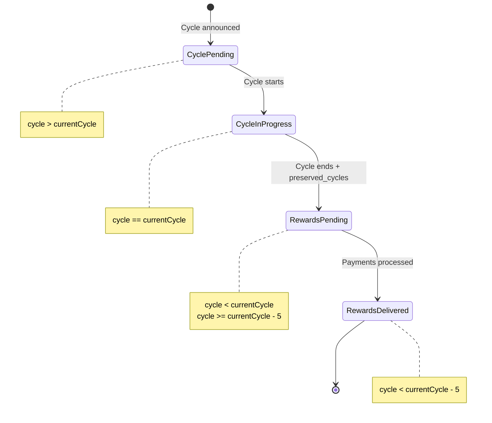

# Business Logic Documentation

## Core Business Concepts

### Tezos Baking & Delegation

**Baking**: The process of creating and signing blocks on the Tezos blockchain.

**Delegation**: Tezos token holders can delegate their tokens to a baker without transferring ownership. Delegators share in the baking rewards proportional to their stake.

**Cycles**: Tezos operates in cycles (currently ~2.8 days, 4096 blocks per cycle). Rewards are calculated and distributed per cycle.

**Reward Delay**: Rewards for cycle N become available ~7 cycles later (preserved_cycles + 2).

---

## 1. Reward Distribution Logic

### 1.1 Core Reward Distribution Algorithm

**Location**: `components/taps.cfc::distributeRewards()`

**Input**:
- `localPendingRewardsCycle`: Cycle number from local database
- `networkPendingRewardsCycle`: Cycle number from blockchain
- `delegators`: Query object with delegator rewards data

**Main Flow**:

```javascript
// Pseudocode representation of the algorithm

function distributeRewards(localPendingCycle, networkPendingCycle, delegators) {
    // Step 1: Update database - mark old cycle as delivered
    UPDATE payments
    SET date = today, result = 'rewards_delivered'
    WHERE cycle = localPendingCycle

    // Step 2: Insert new pending cycle if not exists
    if (!exists(networkPendingCycle)) {
        INSERT INTO payments (cycle, result, total)
        VALUES (networkPendingCycle, 'rewards_pending', 0)
    }

    // Step 3: Get operation mode (off/simulation/on)
    settings = getSettings()
    operationMode = settings.mode  // 'off', 'simulation', or 'on'
    defaultFee = settings.default_fee

    // Step 4: Initialize wallet (if mode = ON)
    if (operationMode == 'on') {
        wallet = TezosJ.init(walletFile, passphrase)
        wallet.setProvider(rpcProvider)
        wallet.clearTransactionBatch()
    }

    // Step 5: Main payment loop with retries
    tries = 0
    blockchainConfirmed = false

    while (!blockchainConfirmed && tries < maxRetries) {
        tries++
        totalPaid = 0

        // Clear previous attempt data
        DELETE FROM delegatorsPayments WHERE cycle = localPendingCycle
        wallet.clearTransactionBatch()

        // Step 6: Process each delegator
        for each delegator in delegators {
            if (delegator.cycle == localPendingCycle) {
                // Calculate payment
                customFee = getDelegatorFee(delegator.address) || defaultFee
                paymentValue = calculatePayment(delegator.rewards, customFee)

                if (operationMode == 'on' && paymentValue > 0) {
                    // Add to batch transaction
                    wallet.addTransactionToBatch(
                        from: bakerAddress,
                        to: delegator.address,
                        amount: paymentValue,
                        fee: defaultTransactionFee
                    )
                    logOutput = `Added send: ${paymentValue} to ${delegator.address}`
                } else if (paymentValue > 0) {
                    logOutput = `Simulated send: ${paymentValue} to ${delegator.address}`
                } else {
                    logOutput = `Ignored ${delegator.address} (value is 0)`
                }

                // Save to database
                INSERT INTO delegatorsPayments (
                    cycle, address, total, result, date
                ) VALUES (
                    localPendingCycle, delegator.address,
                    paymentValue, operationMode, today
                )

                // Write to log
                appendToLog(`payments_${cycle}.log`, logOutput)

                totalPaid += paymentValue
            }
        }

        // Step 7: Send batch transaction (if mode = ON)
        if (operationMode == 'on') {
            try {
                resultJson = wallet.flushTransactionBatch(gasLimit, storageLimit)
                transactionHash = parseHash(resultJson)

                // Validate hash
                if (isInvalidHash(transactionHash)) {
                    throw new Error(transactionHash)
                }

                // Wait for blockchain confirmation
                blockchainConfirmed = wallet.waitForAndCheckResult(
                    transactionHash,
                    numberOfBlocksToWait
                )
            } catch (error) {
                blockchainConfirmed = false
                appendToLog(`last_error_${cycle}.log`, error)
            }
        } else {
            // Simulation mode - no actual transaction
            blockchainConfirmed = true  // Skip retry loop
        }

        // Step 8: Retry logic
        if (!blockchainConfirmed && tries < maxRetries) {
            sleep(minutesBetweenTries * 60 * 1000)
        }
    }

    // Step 9: Update payment results
    if (operationMode == 'on') {
        status = blockchainConfirmed ? 'paid' : 'errors'

        UPDATE payments
        SET result = status, total = totalPaid, transaction_hash = hash
        WHERE cycle = localPendingCycle

        UPDATE delegatorsPayments
        SET result = (blockchainConfirmed ? 'applied' : 'failed'),
            transaction_hash = hash
        WHERE cycle = localPendingCycle

        appendToLog(`batch_result_${cycle}.log`,
                    `Applied: ${blockchainConfirmed} Hash: ${hash}`)
    } else {
        appendToLog(`batch_result_${cycle}.log`,
                    'Simulation only. No transactions sent.')
    }

    // Step 10: Bond Pool Distribution (if enabled and payments successful)
    if (blockchainConfirmed && bondPoolEnabled) {
        distributeBondPoolRewards(localPendingCycle, totalPaid)
    }
}
```

---

### 1.2 Payment Calculation Formula

**Location**: `components/taps.cfc::distributeRewards()` (lines 171-174)

```javascript
// Input:
// - rewards: Delegator's share in mutez (micro-tez) from blockchain
// - fee: Fee percentage (0-100)

// Constants:
const MILITEZ = 1_000_000  // 1 tez = 1,000,000 mutez

// Formula:
paymentValue = ((rewards / MILITEZ) * ((100 - fee) / 100) * 100) / 100

// Breakdown:
// 1. rewards / MILITEZ          -> Convert mutez to tez
// 2. (100 - fee) / 100          -> Calculate keep percentage (e.g., 95% if fee=5%)
// 3. * 100) / 100               -> Precision handling (legacy, could be simplified)

// Examples:
// rewards = 5,432,100 mutez, fee = 5%
// paymentValue = (5432100 / 1000000) * 0.95 = 5.160495 tez

// rewards = 1,000,000 mutez, fee = 10%
// paymentValue = (1000000 / 1000000) * 0.90 = 0.90 tez
```

**Precision**: Payments calculated to 6 decimal places (fixed in v1.2.1).

---

### 1.3 Custom Fee Logic

**Location**: `components/taps.cfc::distributeRewards()` (lines 163-174)

```javascript
function calculateDelegatorPayment(delegatorAddress, rewards, defaultFee) {
    // Check if delegator has custom fee
    customFee = SELECT fee FROM delegatorsFee
                WHERE address = delegatorAddress

    if (customFee.exists) {
        fee = customFee.fee
    } else {
        fee = defaultFee  // From settings table
    }

    payment = ((rewards / MILITEZ) * ((100 - fee) / 100) * 100) / 100

    return payment
}
```

**Use Cases**:
- VIP delegators: 0% fee
- Standard delegators: Default fee (e.g., 5%)
- High-maintenance delegators: Higher fee (e.g., 10%)

---

## 2. Bond Pool Distribution Logic

### 2.1 Bond Pool Overview

**Purpose**: Distribute baker's own rewards (non-delegated portion) to bond pool members.

**When**: After successful delegator payments, if bond pool is enabled.

**Location**: `components/taps.cfc::distributeRewards()` (lines 317-436)

---

### 2.2 Bond Pool Calculation Algorithm

```javascript
function distributeBondPoolRewards(cycle, totalDelegatorPayments) {
    // Step 1: Get total cycle rewards from blockchain
    totalCycleRewards = getTotalBakerRewards(cycle)  // From TzKT API

    // Step 2: Calculate pool rewards (what's left after delegator payments)
    poolRewardsTotal = totalCycleRewards - totalDelegatorPayments

    // Step 3: Get total bond pool stake
    totalBond = SUM(amount) FROM bondPool WHERE baker_id = bakerId

    // Step 4: Get all bond pool members ordered by is_manager, amount
    members = SELECT * FROM bondPool ORDER BY is_manager DESC, amount DESC

    // Step 5: Calculate and distribute
    totalAdmFees = 0
    wallet.clearTransactionBatch()

    for each member in members {
        // Calculate member's share percentage
        memberSharePercent = (member.amount / totalBond) * 100

        // Calculate member's rewards before fee
        memberRewardsBeforeFee = (poolRewardsTotal * memberSharePercent) / 100

        // Calculate administrative fee
        adminFee = memberRewardsBeforeFee * (member.adm_charge / 100)

        // Calculate net payment to member
        memberPayment = memberRewardsBeforeFee - adminFee

        // Accumulate admin fees
        totalAdmFees += adminFee

        // Add to transaction batch
        if (memberPayment > 0) {
            wallet.addTransactionToBatch(
                from: bakerAddress,
                to: member.address,
                amount: memberPayment,
                fee: defaultTransactionFee
            )
        }

        // Identify pool manager (only one)
        if (member.is_manager) {
            poolManager = member.address
            break  // Only one manager allowed
        }
    }

    // Step 6: Pay accumulated admin fees to manager
    if (totalAdmFees > 0) {
        wallet.addTransactionToBatch(
            from: bakerAddress,
            to: poolManager,
            amount: totalAdmFees,
            fee: defaultTransactionFee
        )
    }

    // Step 7: Send batch transaction
    if (operationMode == 'on') {
        resultJson = wallet.flushTransactionBatch()
        // Note: No retry logic for bond pool (as of current version)
        sleep(10 minutes)  // Wait for operation to finish
    } else {
        // Simulation: log transactions
        for each transaction in wallet.getTransactionList() {
            appendToLog(`bondPool_transactions_${cycle}.log`, transaction)
        }
    }
}
```

---

### 2.3 Bond Pool Example

**Scenario**:
- Total cycle rewards: 100 tez
- Delegator payments: 80 tez
- Pool rewards: 20 tez
- Members:
  - Manager: 5000 tez stake, 2% admin charge
  - Member A: 3000 tez stake, 2% admin charge
  - Member B: 2000 tez stake, 2% admin charge
- Total stake: 10,000 tez

**Calculations**:

```javascript
// Manager (50% stake)
managerShare = (5000 / 10000) * 100 = 50%
managerRewardsBefore = 20 * 0.50 = 10 tez
adminFee = 10 * 0.02 = 0.2 tez
managerPayment = 10 - 0.2 = 9.8 tez

// Member A (30% stake)
memberAShare = (3000 / 10000) * 100 = 30%
memberARewardsBefore = 20 * 0.30 = 6 tez
adminFee = 6 * 0.02 = 0.12 tez
memberAPayment = 6 - 0.12 = 5.88 tez

// Member B (20% stake)
memberBShare = (2000 / 10000) * 100 = 20%
memberBRewardsBefore = 20 * 0.20 = 4 tez
adminFee = 4 * 0.02 = 0.08 tez
memberBPayment = 4 - 0.08 = 3.92 tez

// Total admin fees
totalAdminFees = 0.2 + 0.12 + 0.08 = 0.4 tez

// Manager receives additional admin fees
managerTotalPayment = 9.8 + 0.4 = 10.2 tez

// Final payments:
// Manager: 10.2 tez (in 2 transactions)
// Member A: 5.88 tez
// Member B: 3.92 tez
// Total distributed: 20 tez ✓
```

---

## 3. Cycle Change Detection

### 3.1 Scheduled Fetch Logic

**Location**: `script_fetch.cfm`
**Trigger**: Scheduled task every N minutes (default: 10)

```javascript
function scheduledFetch() {
    // Step 1: Get baker rewards from TzKT
    networkRewards = tezosGateway.getRewards(bakerId)

    // Step 2: Determine network pending rewards cycle
    networkPendingCycle = SELECT MIN(cycle) FROM networkRewards
                          WHERE status IN ('rewards_pending', 'cycle_pending')

    // Step 3: Get local pending rewards cycle
    localPendingCycle = SELECT cycle FROM payments
                        WHERE result = 'rewards_pending'

    // Step 4: Initialize if database empty
    if (!localPendingCycle) {
        INSERT INTO payments (cycle, result, total)
        VALUES (networkPendingCycle, 'rewards_pending', 0)
        localPendingCycle = networkPendingCycle
    }

    // Step 5: Detect cycle change
    if (networkPendingCycle > localPendingCycle) {
        // CYCLE HAS CHANGED - Trigger reward distribution

        // Get delegators for the completed cycle
        delegators = tezosGateway.getDelegators(
            bakerId,
            localPendingCycle,
            localPendingCycle
        )

        // Distribute rewards
        distributeRewards(
            localPendingCycle,
            networkPendingCycle,
            delegators
        )
    }

    // Step 6: Store delegator data for all known cycles
    // (Maintains 3 cycles of data: current, pending, next)
    allDelegators = tezosGateway.getDelegators(
        bakerId,
        currentCycle - 5,
        currentCycle + 10
    )

    // Save to database for reporting
    storeDelegatorsInDatabase(allDelegators)

    // Step 7: Ensure all delegators have fee entries
    storeDefaultDelegatorsFee(allDelegators)
}
```

---

### 3.2 Cycle Status State Machine



**Status Mapping** (`tezosGateway.cfc::getRewards()`):

```javascript
currentCycle = getCurrentCycleFromBlockchain()

for each cycle in rewards {
    if (cycle < currentCycle - 5) {
        status = "rewards_delivered"
    } else if (cycle < currentCycle) {
        status = "rewards_pending"
    } else if (cycle == currentCycle) {
        status = "cycle_in_progress"
    } else {  // cycle > currentCycle
        status = "cycle_pending"
    }
}
```

---

## 4. Wallet & Transaction Logic

### 4.1 Wallet Creation/Import

**Location**: `wallet.cfm`

```javascript
function createWallet(mnemonicWords, passphrase, userPassword) {
    // Step 1: Create wallet from mnemonic using TezosJ SDK
    wallet = TezosJ.importWallet(mnemonicWords, passphrase)

    // Step 2: Save wallet to encrypted file
    walletFilePath = "./wallet/wallet.taps"
    wallet.save(walletFilePath)

    // Step 3: Encrypt passphrase (dual encryption)
    // a) User password encryption (for wallet opening)
    encryptedWithUserPass = encrypt(passphrase, userPassword)

    // b) Application seed encryption (for automated operations)
    encryptedWithAppSeed = encrypt(passphrase, APP_SEED)

    // Step 4: Hash passphrase for authentication
    salt = generateRandomSalt()
    passphraseHash = SHA512(passphrase + salt)

    // Step 5: Save to database
    UPDATE settings SET
        wallet_hash = passphraseHash,
        wallet_salt = salt,
        phrase = encryptedWithUserPass,
        app_phrase = encryptedWithAppSeed
    WHERE baker_id = bakerId

    return wallet.getPublicKeyHash()  // tz1... address
}
```

---

### 4.2 Wallet Authentication

**Location**: `components/database.cfc::authWallet()`

```javascript
function authenticateWallet(bakerId, passphrase) {
    // Retrieve stored hash and salt
    settings = SELECT wallet_hash, wallet_salt FROM settings
               WHERE baker_id = bakerId

    if (!settings.exists) {
        return false
    }

    // Hash provided passphrase with stored salt
    hashedInput = SHA512(passphrase + settings.wallet_salt)

    // Compare hashes
    if (hashedInput == settings.wallet_hash) {
        return true
    } else {
        return false
    }
}
```

---

### 4.3 Batch Transaction Construction

**Location**: Throughout `taps.cfc::distributeRewards()` and `sendCustomBatch()`

```javascript
function buildAndSendBatchTransaction(transactions) {
    // Step 1: Initialize TezosJ wallet
    wallet = TezosJ.init(walletFile, passphrase)
    wallet.setProvider(rpcProviderURL)

    // Step 2: Clear any previous batch
    wallet.clearTransactionBatch()

    // Step 3: Add transactions to batch
    for each tx in transactions {
        wallet.addTransactionToBatch(
            from: bakerAddress,
            to: tx.recipient,
            amount: tx.amount,  // BigDecimal in tez
            fee: tx.fee         // BigDecimal in tez
        )
    }

    // Step 4: Flush batch (sign and broadcast)
    resultJson = wallet.flushTransactionBatch(
        gasLimit: 15400,
        storageLimit: 300
    )

    // Step 5: Parse result
    result = parseJSON(resultJson)
    transactionHash = result.result.replace('"', '')

    // Step 6: Validate hash format
    if (transactionHash.includes("error") ||
        transactionHash.length < 40 ||
        transactionHash.length > 60) {
        throw new Error("Invalid transaction hash: " + transactionHash)
    }

    // Step 7: Wait for confirmation
    confirmed = wallet.waitForAndCheckResult(
        transactionHash,
        numberOfBlocksToWait  // Default: 8 blocks
    )

    return {
        hash: transactionHash,
        confirmed: confirmed
    }
}
```

**Batch Transaction Benefits**:
- All delegators paid in single blockchain operation
- Single transaction fee (amortized across all recipients)
- Atomic operation (all succeed or all fail)
- Efficient blockchain resource usage

---

## 5. Authentication & Security

### 5.1 User Authentication

**Location**: `components/taps.cfc::authenticate()`

```javascript
function authenticateUser(username, password) {
    // Step 1: Retrieve stored hash and salt
    settings = SELECT pass_hash, hash_salt FROM settings

    if (settings.recordCount == 0) {
        // First-time login with defaults
        if (username == "admin" && password == "admin") {
            application.user = username
            return true
        } else {
            return false
        }
    }

    // Step 2: Hash input password with stored salt
    hashedInput = SHA512(password + settings.hash_salt)

    // Step 3: Compare hashes
    if (hashedInput == settings.pass_hash) {
        application.user = username
        return true
    } else {
        return false
    }
}
```

---

### 5.2 Password Change Logic

**Location**: `components/database.cfc::changePassdw()`

```javascript
function changePassword(user, bakerId, currentPassword, newPassword, confirmPassword) {
    // Step 1: Validate inputs
    if (!allFieldsProvided || newPassword != confirmPassword) {
        return false
    }

    // Step 2: Authenticate with current password
    authResult = authenticateUser(user, currentPassword)
    if (!authResult) {
        return false
    }

    // Step 3: Generate new salt and hash
    newSalt = SHA512(generateRandomAESKey())
    newHash = SHA512(newPassword + newSalt)

    // Step 4: Update database
    UPDATE settings SET
        pass_hash = newHash,
        hash_salt = newSalt
    WHERE baker_id = bakerId

    return true
}
```

**Security Note**: Changing user password DOES NOT re-encrypt wallet passphrase. Wallet passphrase encryption is separate.

---

## 6. Validation Rules

### 6.1 Setup Validation

**Location**: `setup.cfm`

```javascript
function validateSetup(formData) {
    errors = []

    // Required fields
    if (isEmpty(baker) || isEmpty(fee) || isEmpty(freq) ||
        isEmpty(user) || isEmpty(passdw) || isEmpty(passdw2) ||
        isEmpty(luceePort)) {
        errors.push("All fields are required")
    }

    // Numeric validation
    if (!isNumeric(fee) || !isNumeric(freq) || !isNumeric(luceePort)) {
        errors.push("Fee, frequency, and port must be numeric")
    }

    // Password match
    if (passdw != passdw2) {
        errors.push("Passwords do not match")
    }

    // Baker address format (basic check)
    if (!baker.startsWith("tz1") && !baker.startsWith("tz2") && !baker.startsWith("tz3")) {
        errors.push("Invalid baker address format")
    }

    // Fee range
    if (fee < 0 || fee > 100) {
        errors.push("Fee must be between 0 and 100")
    }

    // Frequency minimum
    if (freq < 1) {
        errors.push("Frequency must be at least 1 minute")
    }

    return errors
}
```

---

### 6.2 Transaction Validation

```javascript
function validateTransaction(toAddress, amount) {
    errors = []

    // Address format
    if (!toAddress.startsWith("tz") && !toAddress.startsWith("KT")) {
        errors.push("Invalid recipient address")
    }

    // Amount positive
    if (amount <= 0) {
        errors.push("Amount must be greater than 0")
    }

    // Sufficient balance
    currentBalance = wallet.getBalance() / MILITEZ
    if (amount > currentBalance) {
        errors.push("Insufficient balance")
    }

    return errors
}
```

---

## 7. Logging & Audit Trail

### 7.1 Log File Structure

**Payment Log** (`logs/payments_{cycle}.log`):
```
Added send transaction: 5.123456 tez from tz1baker... to tz1delegator1...
Added send transaction: 3.456789 tez from tz1baker... to tz1delegator2...
Ignored send to tz1delegator3... as value is 0
...
```

**Batch Result Log** (`logs/batch_result_{cycle}.log`):
```
Applied: true Hash: opABC123XYZ...
```

**Error Log** (`logs/last_error_{cycle}.log`):
```
Insufficient balance for transaction
Error details: ...
```

**Bond Pool Log** (`logs/bondPool_transactions_{cycle}.log`):
```
tz1baker..., tz1manager..., 10.2, 0.001800
tz1baker..., tz1member1..., 5.88, 0.001800
tz1baker..., tz1member2..., 3.92, 0.001800
```

---

### 7.2 Database Audit Trail

All payments are recorded in `delegatorsPayments` table with:
- Cycle number
- Delegator address
- Amount paid
- Date
- Result status
- Transaction hash

This provides complete audit trail for:
- Tax reporting
- Delegator inquiries
- System debugging
- Historical analysis

---

## 8. Error Handling & Retry Logic

### 8.1 Payment Retry Mechanism

**Location**: `components/taps.cfc::distributeRewards()` (lines 131-275)

```javascript
maxRetries = application.paymentRetries  // Default: 1
minutesBetween = application.minutesBetweenTries  // Default: 1
tries = 0
blockchainConfirmed = false

while (!blockchainConfirmed && tries < maxRetries) {
    tries++

    try {
        // Attempt payment
        resultJson = wallet.flushTransactionBatch()
        transactionHash = extractHash(resultJson)

        // Wait for confirmation
        blockchainConfirmed = wallet.waitForAndCheckResult(
            transactionHash,
            numberOfBlocksToWait
        )
    } catch (error) {
        blockchainConfirmed = false
        logError(error)
    }

    if (!blockchainConfirmed && tries < maxRetries) {
        // Wait before retry
        sleep(minutesBetween * 60 * 1000)
    }
}

// After all retries
if (!blockchainConfirmed) {
    // Mark as failed
    UPDATE payments SET result = 'errors'
    UPDATE delegatorsPayments SET result = 'failed'
} else {
    // Mark as successful
    UPDATE payments SET result = 'paid'
    UPDATE delegatorsPayments SET result = 'applied'
}
```

---

### 8.2 API Request Retry

**Location**: `components/tezosGateway.cfc::doHttpRequest()`

```javascript
function doHttpRequest(url) {
    // Try 1: Linux curl
    try {
        return execCurl(url, timeout=240s)
    } catch {
        // Try 2: Linux wget
        try {
            return execWget(url, timeout=240s)
        } catch {
            // Try 3: ColdFusion cfhttp
            return cfhttp(url, timeout=240s)
        }
    }
}
```

**Fallback Strategy**: Multiple methods ensure requests succeed even if one tool fails.

---

## 9. Operation Modes

### 9.1 Mode Behavior

| Mode | Scheduled Task | Database Updates | Blockchain Transactions | Logs Generated |
|------|---------------|------------------|------------------------|----------------|
| **Off** | Paused | No | No | No |
| **Simulation** | Running | Yes | No | Yes |
| **On** | Running | Yes | Yes | Yes |

---

### 9.2 Mode Transitions

```javascript
function setOperationMode(mode) {
    if (mode == MODE_OFF) {
        // Pause scheduled task
        pauseScheduledTask()
        UPDATE settings SET mode = 'off'
    } else if (mode == MODE_SIMULATION) {
        // Resume scheduled task, but don't send transactions
        resumeScheduledTask()
        UPDATE settings SET mode = 'simulation'
    } else if (mode == MODE_ON) {
        // Resume scheduled task and send real transactions
        resumeScheduledTask()
        UPDATE settings SET mode = 'on'
    }
}
```

**Use Cases**:
- **Off**: Maintenance, vacation, or pause operations
- **Simulation**: Test configuration, verify calculations before going live
- **On**: Production mode with real payments

---

## 10. Data Consistency Rules

### 10.1 Cycle Data Integrity

**Rules**:
1. Only one `rewards_pending` entry at a time in `payments` table
2. All delegators for a cycle share same transaction hash (batch)
3. Cycle numbers are sequential and non-negative integers
4. Payment totals match sum of delegator payments

**Enforcement**:
```javascript
// Before distributing new cycle
assert(SELECT COUNT(*) FROM payments WHERE result='rewards_pending' == 1)

// After distribution
assert(payments.total == SUM(delegatorsPayments.total WHERE cycle=X))

// Transaction hash consistency
assert(SELECT DISTINCT transaction_hash FROM delegatorsPayments
       WHERE cycle=X).count == 1
```

---

### 10.2 Bond Pool Constraints

**Rules**:
1. Only one `is_manager=true` per baker_id
2. Sum of admin fees distributed to manager
3. Member stakes must be positive
4. Admin charges between 0-100%

**Enforcement**:
```javascript
// When updating bond pool member
if (member.is_manager == true) {
    UPDATE bondPool SET is_manager = false
    WHERE baker_id = X AND address != member.address
}

// Validation
assert(member.amount > 0)
assert(member.adm_charge >= 0 && member.adm_charge <= 100)
```

---

## Summary of Critical Business Rules

1. **Reward Calculation**: `payment = (rewards_mutez / 1M) * (1 - fee%)`
2. **Fee Hierarchy**: Custom fee > Default fee
3. **Cycle Detection**: Local pending < Network pending triggers distribution
4. **Batch Transactions**: All delegators in single blockchain operation
5. **Bond Pool**: Distributes (total_rewards - delegator_payments) to members
6. **Admin Fees**: Collected from all members, paid to manager
7. **Retry Logic**: Configurable retries with exponential backoff
8. **Precision**: 6 decimal places for tez amounts
9. **Status Flow**: rewards_pending → rewards_delivered → paid/simulated
10. **Audit Trail**: All payments logged to database and files

---

*This document captures the complete business logic. See MIGRATION_GUIDE.md for implementation strategies in TypeScript.*
