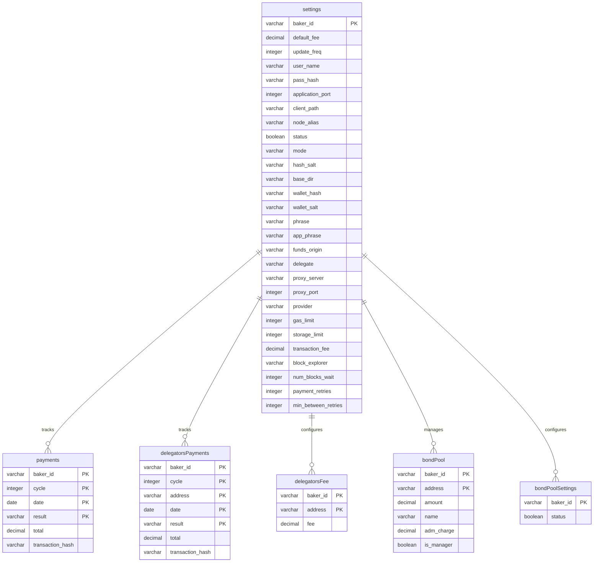

# Database Schema Documentation

## Database Overview

**Database Type**: H2 Embedded Database
**Mode**: MySQL compatibility mode
**Connection String**: `jdbc:h2:{path}/database/tapsDB;MODE=MySQL`
**Location**: `database/` directory (auto-created in application root)

## Entity-Relationship Diagram



## Table Schemas

### 1. settings
**Purpose**: Stores application configuration and user settings

| Column | Type | Nullable | Default | Description |
|--------|------|----------|---------|-------------|
| baker_id | VARCHAR(50) | NOT NULL | - | Tezos baker address (tz1...) **PK** |
| default_fee | DECIMAL(6,2) | NOT NULL | - | Default fee percentage for delegators |
| update_freq | INTEGER | NOT NULL | - | Blockchain fetch frequency (minutes) |
| user_name | VARCHAR(100) | NULL | - | Login username |
| pass_hash | VARCHAR(150) | NULL | - | SHA-512 hashed password |
| application_port | INTEGER | NOT NULL | - | Lucee server port |
| client_path | VARCHAR(200) | NOT NULL | - | Tezos client path (legacy) |
| node_alias | VARCHAR(100) | NOT NULL | - | Node alias (legacy) |
| status | BOOLEAN | NULL | - | Configuration status |
| mode | VARCHAR(20) | NULL | - | Operation mode: "off", "simulation", "on" |
| hash_salt | VARCHAR(150) | NULL | - | Salt for password hashing |
| base_dir | VARCHAR(200) | NOT NULL | - | Base directory (legacy) |
| wallet_hash | VARCHAR(150) | NULL | - | SHA-512 wallet passphrase hash |
| wallet_salt | VARCHAR(150) | NULL | - | Salt for wallet passphrase |
| phrase | VARCHAR(150) | NULL | - | Encrypted passphrase (user password) |
| app_phrase | VARCHAR(150) | NULL | - | Encrypted passphrase (app seed) |
| funds_origin | VARCHAR(20) | NULL | - | "native" or "node" (legacy) |
| delegate | VARCHAR(50) | NULL | '' | Delegate address |
| proxy_server | VARCHAR(70) | NULL | '' | Proxy server URL |
| proxy_port | INTEGER | NULL | 80 | Proxy port |
| provider | VARCHAR(70) | NOT NULL | - | Tezos RPC provider URL |
| gas_limit | INTEGER | NOT NULL | 15400 | Gas limit for transactions |
| storage_limit | INTEGER | NOT NULL | 300 | Storage limit for transactions |
| transaction_fee | DECIMAL(20,6) | NOT NULL | 0.001800 | Default transaction fee (ꜩ) |
| block_explorer | VARCHAR(70) | NOT NULL | - | Block explorer URL |
| num_blocks_wait | INTEGER | NOT NULL | 8 | Blocks to wait for confirmation |
| payment_retries | INTEGER | NOT NULL | 1 | Number of payment retry attempts |
| min_between_retries | INTEGER | NOT NULL | 1 | Minutes between retry attempts |

**Primary Key**: `baker_id`

**Example Row**:
```sql
baker_id: tz1abcdefghijklmnopqrstuvwxyz123456
default_fee: 5.00
update_freq: 10
mode: on
provider: https://mainnet-tezos.giganode.io
gas_limit: 15400
storage_limit: 300
transaction_fee: 0.001800
```

---

### 2. payments
**Purpose**: Tracks payment cycles and total amounts distributed

| Column | Type | Nullable | Default | Description |
|--------|------|----------|---------|-------------|
| baker_id | VARCHAR(50) | NOT NULL | - | Tezos baker address **PK** |
| cycle | INTEGER | NOT NULL | - | Tezos cycle number **PK** |
| date | DATE | NULL | - | Payment date **PK** |
| result | VARCHAR(20) | NOT NULL | - | Payment status **PK** |
| total | DECIMAL(20,6) | NOT NULL | - | Total amount paid in cycle (ꜩ) |
| transaction_hash | VARCHAR(70) | NULL | - | Tezos transaction hash (op...) |

**Primary Key**: `(baker_id, cycle, date, result)`

**Result Values**:
- `rewards_pending`: Cycle not yet paid
- `rewards_delivered`: Cycle rewards available from blockchain
- `paid`: Successfully paid
- `simulated`: Simulation mode payment
- `errors`: Payment failed

**Example Rows**:
```sql
-- Pending cycle
baker_id: tz1abc..., cycle: 500, date: 2024-01-15, result: rewards_pending, total: 0.000000

-- Completed payment
baker_id: tz1abc..., cycle: 499, date: 2024-01-15, result: paid, total: 125.543210,
transaction_hash: opXYZ123...
```

---

### 3. delegatorsPayments
**Purpose**: Tracks individual delegator payments per cycle

| Column | Type | Nullable | Default | Description |
|--------|------|----------|---------|-------------|
| baker_id | VARCHAR(50) | NOT NULL | - | Tezos baker address **PK** |
| cycle | INTEGER | NOT NULL | - | Tezos cycle number **PK** |
| address | VARCHAR(50) | NOT NULL | - | Delegator address (tz1...) **PK** |
| date | DATE | NULL | - | Payment date **PK** |
| result | VARCHAR(20) | NOT NULL | - | Payment status **PK** |
| total | DECIMAL(20,6) | NOT NULL | - | Amount paid to delegator (ꜩ) |
| transaction_hash | VARCHAR(70) | NULL | - | Tezos transaction hash |

**Primary Key**: `(baker_id, cycle, address, date, result)`

**Result Values**:
- `applied`: Transaction confirmed on blockchain
- `simulated`: Simulation mode payment
- `failed`: Transaction failed
- `not available`: Payment not yet processed

**Example Rows**:
```sql
baker_id: tz1abc..., cycle: 499, address: tz1delegator1..., date: 2024-01-15,
result: applied, total: 5.123456, transaction_hash: opXYZ123...

baker_id: tz1abc..., cycle: 499, address: tz1delegator2..., date: 2024-01-15,
result: applied, total: 3.654321, transaction_hash: opXYZ123...
```

**Notes**:
- All delegators in a cycle share the same transaction_hash (batch transaction)
- Six decimal places precision for accurate payments

---

### 4. delegatorsFee
**Purpose**: Stores custom fee percentages for individual delegators

| Column | Type | Nullable | Default | Description |
|--------|------|----------|---------|-------------|
| baker_id | VARCHAR(50) | NOT NULL | - | Tezos baker address **PK** |
| address | VARCHAR(50) | NOT NULL | - | Delegator address **PK** |
| fee | DECIMAL(6,2) | NOT NULL | - | Fee percentage (0-100) |

**Primary Key**: `(baker_id, address)`

**Fee Calculation**:
```
payment_to_delegator = rewards * (100 - fee) / 100
```

**Example Rows**:
```sql
baker_id: tz1abc..., address: tz1delegator1..., fee: 5.00
baker_id: tz1abc..., address: tz1delegator2..., fee: 10.00
baker_id: tz1abc..., address: tz1delegator3..., fee: 0.00
```

**Default Behavior**:
- If delegator not in this table, uses `settings.default_fee`
- Fee is automatically inserted for all delegators on first setup

---

### 5. bondPoolSettings
**Purpose**: Configuration for bond pool feature

| Column | Type | Nullable | Default | Description |
|--------|------|----------|---------|-------------|
| baker_id | VARCHAR(50) | NOT NULL | - | Tezos baker address **PK** |
| status | BOOLEAN | NOT NULL | - | Bond pool enabled/disabled |

**Primary Key**: `baker_id`

**Example Row**:
```sql
baker_id: tz1abc..., status: true
```

---

### 6. bondPool
**Purpose**: Stores bond pool member stakes and administrative fees

| Column | Type | Nullable | Default | Description |
|--------|------|----------|---------|-------------|
| baker_id | VARCHAR(50) | NOT NULL | - | Tezos baker address **PK** |
| address | VARCHAR(50) | NOT NULL | - | Bond pool member address **PK** |
| amount | DECIMAL(20,2) | NOT NULL | - | Member's stake amount (ꜩ) |
| name | VARCHAR(50) | NULL | - | Member display name |
| adm_charge | DECIMAL(20,2) | NOT NULL | - | Administrative fee percentage |
| is_manager | BOOLEAN | NULL | - | Is pool manager (only one) |

**Primary Key**: `(baker_id, address)`

**Bond Pool Payment Logic**:
```
total_cycle_rewards = getTotalRewardsFromBlockchain(cycle)
total_delegator_payments = SUM(delegatorsPayments.total WHERE cycle=X)
pool_rewards = total_cycle_rewards - total_delegator_payments

member_share_percentage = member.amount / SUM(all_members.amount) * 100
member_rewards_before_fee = pool_rewards * member_share_percentage / 100
admin_fee_amount = member_rewards_before_fee * member.adm_charge / 100
member_payment = member_rewards_before_fee - admin_fee_amount

-- Admin fees collected and paid to pool manager
total_admin_fees = SUM(admin_fee_amount for all members)
manager_receives = member_payment + total_admin_fees (if is_manager=true)
```

**Example Rows**:
```sql
-- Pool manager with 50% stake, 2% admin charge
baker_id: tz1abc..., address: tz1manager..., amount: 5000.00, name: Manager,
adm_charge: 2.00, is_manager: true

-- Regular member with 30% stake, 2% admin charge
baker_id: tz1abc..., address: tz1member1..., amount: 3000.00, name: Member 1,
adm_charge: 2.00, is_manager: false

-- Regular member with 20% stake, 2% admin charge
baker_id: tz1abc..., address: tz1member2..., amount: 2000.00, name: Member 2,
adm_charge: 2.00, is_manager: false
```

**Constraints**:
- Only one `is_manager=true` per baker_id
- Admin fees go to the manager

---

## Common Queries

### Get Current Configuration
```sql
SELECT * FROM settings WHERE baker_id = ?
```

### Get Pending Payment Cycle
```sql
SELECT cycle FROM payments
WHERE LOWER(result) = 'rewards_pending'
ORDER BY cycle ASC
LIMIT 1
```

### Get Payment History for Cycle
```sql
SELECT * FROM delegatorsPayments
WHERE baker_id = ? AND cycle = ?
ORDER BY total DESC
```

### Get Delegators with Custom Fees
```sql
SELECT df.address, df.fee
FROM delegatorsFee df
WHERE df.baker_id = ?
ORDER BY df.fee DESC
```

### Get Bond Pool Total Stake
```sql
SELECT SUM(amount) as total_stake
FROM bondPool
WHERE baker_id = ?
```

### Get Bond Pool Manager
```sql
SELECT * FROM bondPool
WHERE baker_id = ? AND is_manager = true
LIMIT 1
```

### Get All Payments for a Delegator
```sql
SELECT cycle, date, result, total, transaction_hash
FROM delegatorsPayments
WHERE baker_id = ? AND address = ?
ORDER BY cycle DESC
```

### Get Cycle Payment Summary
```sql
SELECT
    cycle,
    COUNT(DISTINCT address) as num_delegators,
    SUM(total) as total_paid,
    MAX(transaction_hash) as tx_hash,
    result
FROM delegatorsPayments
WHERE baker_id = ?
GROUP BY cycle, result
ORDER BY cycle DESC
```

---

## Data Migration Notes

### For TypeScript/Node.js Migration

**Recommended Database**: PostgreSQL or MySQL

**Schema Changes Needed**:

1. **Add Timestamps**:
   - Add `created_at TIMESTAMP` to all tables
   - Add `updated_at TIMESTAMP` to all tables

2. **Add Auto-increment IDs** (optional for better performance):
   - `settings`: Keep baker_id as PK (natural key)
   - `payments`: Add `id SERIAL PRIMARY KEY`, keep composite unique index
   - `delegatorsPayments`: Add `id SERIAL PRIMARY KEY`, keep composite unique index
   - `delegatorsFee`: Keep composite PK
   - `bondPool`: Keep composite PK

3. **Normalize Enums**:
   - Create `operation_modes` enum: 'off', 'simulation', 'on'
   - Create `payment_statuses` enum: 'rewards_pending', 'rewards_delivered', 'paid', 'simulated', 'errors', 'applied', 'failed'

4. **Add Indexes**:
```sql
CREATE INDEX idx_payments_cycle ON payments(cycle);
CREATE INDEX idx_payments_result ON payments(result);
CREATE INDEX idx_delegators_payments_cycle ON delegatorsPayments(cycle);
CREATE INDEX idx_delegators_payments_address ON delegatorsPayments(address);
CREATE INDEX idx_delegators_payments_result ON delegatorsPayments(result);
CREATE INDEX idx_delegators_fee_address ON delegatorsFee(address);
```

5. **Add Foreign Keys**:
```sql
ALTER TABLE payments ADD CONSTRAINT fk_payments_baker
    FOREIGN KEY (baker_id) REFERENCES settings(baker_id) ON DELETE CASCADE;

ALTER TABLE delegatorsPayments ADD CONSTRAINT fk_delegators_payments_baker
    FOREIGN KEY (baker_id) REFERENCES settings(baker_id) ON DELETE CASCADE;

ALTER TABLE delegatorsFee ADD CONSTRAINT fk_delegators_fee_baker
    FOREIGN KEY (baker_id) REFERENCES settings(baker_id) ON DELETE CASCADE;

ALTER TABLE bondPool ADD CONSTRAINT fk_bond_pool_baker
    FOREIGN KEY (baker_id) REFERENCES settings(baker_id) ON DELETE CASCADE;

ALTER TABLE bondPoolSettings ADD CONSTRAINT fk_bond_pool_settings_baker
    FOREIGN KEY (baker_id) REFERENCES settings(baker_id) ON DELETE CASCADE;
```

6. **Data Type Adjustments**:
   - Change all `DECIMAL(20,6)` to use consistent precision
   - Use `TEXT` instead of long VARCHARs for hashes
   - Use `JSONB` for storing complex configuration (PostgreSQL)

---

## Sample Data for Testing

```sql
-- Settings
INSERT INTO settings (baker_id, default_fee, update_freq, user_name, pass_hash,
    application_port, client_path, node_alias, mode, hash_salt, base_dir, funds_origin,
    provider, gas_limit, storage_limit, transaction_fee, block_explorer,
    num_blocks_wait, payment_retries, min_between_retries, proxy_port)
VALUES (
    'tz1abcdefghijklmnopqrstuvwxyz123456',
    5.00,
    10,
    'admin',
    'hashed_password_here',
    8888,
    '',
    '',
    'simulation',
    'random_salt_here',
    '',
    'native',
    'https://mainnet-tezos.giganode.io',
    15400,
    300,
    0.001800,
    'https://tzstats.com/',
    8,
    1,
    1,
    80
);

-- Pending payment
INSERT INTO payments (baker_id, cycle, date, result, total)
VALUES ('tz1abc...', 500, '2024-01-15', 'rewards_pending', 0.000000);

-- Custom fee for VIP delegator
INSERT INTO delegatorsFee (baker_id, address, fee)
VALUES ('tz1abc...', 'tz1vip_delegator...', 0.00);
```

---

*This schema documentation provides the complete database structure for migration. See MIGRATION_GUIDE.md for ORM recommendations and migration strategies.*
